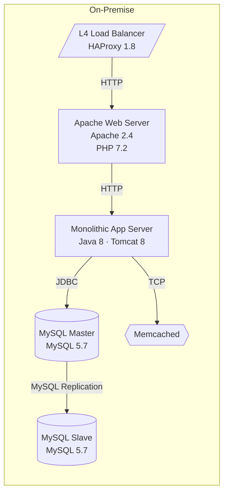

# ArchPilot — 사용자 가이드

> 시스템 입력부터 발표까지 — 실제 예제로 배우는 단계별 워크플로우

버전: 0.2.1
최종 수정: 2026-03-13

---

## 목차

1. [설치 및 초기 설정](#1-설치-및-초기-설정)
2. [워크플로우 개요](#2-워크플로우-개요)
3. [시나리오 A — YAML 파일로 시작하기](#3-시나리오-a--yaml-파일로-시작하기)
4. [시나리오 B — draw.io Desktop으로 시작하기](#4-시나리오-b--drawio-desktop으로-시작하기)
5. [시나리오 C — draw.io Web(diagrams.net)으로 시작하기](#5-시나리오-c--drawio-webdiagramsnet으로-시작하기)
6. [시나리오 D — 자연어 텍스트로 시작하기](#6-시나리오-d--자연어-텍스트로-시작하기)
7. [시나리오 E — 인터랙티브 웹 앱으로 전체 플로우](#7-시나리오-e--인터랙티브-웹-앱으로-전체-플로우)
8. [LLM 분석 및 현대화 설계](#8-llm-분석-및-현대화-설계)
9. [발표 자료 생성 및 서버 실행](#9-발표-자료-생성-및-서버-실행)
10. [draw.io Desktop 양방향 편집 워크플로우](#10-drawio-desktop-양방향-편집-워크플로우)
11. [출력 파일 구조](#11-출력-파일-구조)
12. [자주 묻는 질문 (FAQ)](#12-자주-묻는-질문-faq)

---

## 1. 설치 및 초기 설정

### 1.1 설치

```bash
pip install archpilot
```

**선택적 의존성:**
```bash
pip install graphviz        # PNG 다이어그램 생성 시 필요
pip install watchdog        # draw.io 파일 자동 감시 시 필요
```

### 1.2 초기화

```bash
archpilot init
```

실행하면 `~/.archpilot/config.env` 전역 설정 파일 생성 마법사가 시작됩니다:

```
ArchPilot 초기화 마법사

OpenAI API Key: sk-...
모델 [gpt-4o]: (Enter로 기본값 사용)
출력 디렉토리 [/home/yourname/project/output]: (Enter로 기본값 사용)

✅ 설정 파일이 생성되었습니다: /home/yourname/.archpilot/config.env
   출력 디렉토리: /home/yourname/project/output
```

생성된 `~/.archpilot/config.env`:
```env
OPENAI_API_KEY=sk-...
OPENAI_MODEL=gpt-4o
OPENAI_MAX_TOKENS=4096
ARCHPILOT_OUTPUT_DIR=/home/yourname/project/output
ARCHPILOT_DIAGRAM_FORMAT=png
ARCHPILOT_SERVER_HOST=127.0.0.1
ARCHPILOT_SERVER_PORT=8080
```

> **팁**: 전역 설정은 어느 디렉토리에서 `archpilot`을 실행해도 자동으로 로드됩니다.
> 프로젝트별로 다른 설정이 필요하면 해당 디렉토리에 `.env`를 만들면 전역 설정을 오버라이드합니다.

---

## 2. 워크플로우 개요

모든 시나리오는 동일한 3단계 파이프라인을 거칩니다:

```
┌─────────────────┐    ┌─────────────────┐    ┌─────────────────┐
│  1. 시스템 입력  │ →  │  2. AI 분석·설계 │ →  │  3. 발표 자료    │
│                 │    │                 │    │                 │
│  • YAML/JSON    │    │  archpilot      │    │  archpilot      │
│  • draw.io      │    │  analyze        │    │  serve          │
│  • 자연어 텍스트│    │                 │    │                 │
│  • 채팅 입력    │    │  archpilot      │    │  → 브라우저 자동  │
│                 │    │  modernize      │    │    오픈          │
└─────────────────┘    └─────────────────┘    └─────────────────┘
         ↓                      ↓                      ↓
    output/system.json    output/analysis.json    http://localhost:8080
                          output/modern/          /slides (발표 모드)
```

---

## 3. 시나리오 A — YAML 파일로 시작하기

### 대상: 이미 시스템 구성 정보가 있는 경우

이 시나리오는 `examples/legacy_ecommerce.yaml`을 사용합니다.
2015년 구축된 온프레미스 모놀리식 이커머스 시스템입니다.

### Step 1: 예시 YAML 확인

```yaml
# examples/legacy_ecommerce.yaml
name: "E-Commerce Legacy System"
description: "2015년 구축된 온프레미스 모놀리식 쇼핑몰 시스템"

components:
  - id: web
    type: server
    label: "Apache Web Server"
    tech: ["Apache 2.4", "PHP 7.2"]
    host: on-premise
    specs:
      cpu: 8
      memory: "32GB"

  - id: app
    type: server
    label: "Monolithic App Server"
    tech: ["Java 8", "Spring MVC", "Tomcat 8"]
    host: on-premise
    specs:
      cpu: 16
      memory: "64GB"

  - id: db_master
    type: database
    label: "MySQL Master"
    tech: ["MySQL 5.7"]
    host: on-premise

  - id: db_slave
    type: database
    label: "MySQL Slave"
    tech: ["MySQL 5.7"]
    host: on-premise

  - id: cache
    type: cache
    label: "Memcached"
    tech: ["Memcached 1.6"]
    host: on-premise

  - id: lb
    type: loadbalancer
    label: "L4 Load Balancer"
    tech: ["HAProxy 1.8"]
    host: on-premise

connections:
  - from_id: lb
    to_id: web
    protocol: HTTP
  - from_id: app
    to_id: db_master
    protocol: JDBC
  - from_id: app
    to_id: cache
    protocol: TCP
```

**YAML 작성 팁:**
- `type` 생략 가능 — `tech` 배열에서 자동 추론 (예: `MySQL 5.7` → `database`)
- `host` 생략 시 `on-premise` 기본값
- `from_id` / `to_id`는 반드시 `components`에 정의된 `id`와 일치해야 함

### Step 2: ingest 실행

```bash
archpilot ingest examples/legacy_ecommerce.yaml --format mermaid,drawio
```

출력:
```
✅ 파싱 완료: E-Commerce Legacy System
   컴포넌트: 6개  연결: 5개

┌─────────────────────────────────────┐
│ 생성된 파일                          │
├─────────────────────┬───────────────┤
│ output/system.json  │ SystemModel   │
│ output/legacy/      │               │
│   diagram.mmd       │ Mermaid DSL   │
│   diagram.drawio    │ draw.io XML   │
└─────────────────────┴───────────────┘
```

생성된 `output/legacy/diagram.mmd` 내용:


---

## 4. 시나리오 B — draw.io Desktop으로 시작하기

### 대상: draw.io Desktop에서 다이어그램을 직접 그려 입력하려는 경우

### Step 1: draw.io Desktop 통합 설정 (최초 1회)

```bash
archpilot drawio setup
```

출력:
```
⚙️  draw.io Desktop 통합 설정

✅ draw.io 발견: /Applications/draw.io.app
✅ 라이브러리 생성: /Users/yourname/.archpilot/archpilot-library.drawio.xml
   draw.io Desktop이 닫혀 있어야 합니다.
✅ localStorage 등록: ~/Library/Application Support/draw.io/Local Storage/leveldb

┌──────────────────────────────────────────────────┐
│                   설치 완료                       │
│  라이브러리 파일  ~/.archpilot/archpilot-library  │
│  localStorage    ~/Library/.../leveldb            │
└──────────────────────────────────────────────────┘

다음 단계: draw.io Desktop을 시작하면 ArchPilot 라이브러리가 사이드바에 표시됩니다.
```

> **Linux Snap 사용자:** `/snap/bin/drawio`와 `~/snap/drawio/common/...` 경로를 자동으로 탐색합니다.
>
> **Windows 사용자:** `%ProgramFiles%\draw.io\draw.io.exe`와 `%LOCALAPPDATA%\Programs\draw.io\draw.io.exe` 모두 탐색합니다.

### Step 2: draw.io Desktop에서 다이어그램 그리기

draw.io Desktop을 실행하면 좌측 사이드바에 **ArchPilot** 컴포넌트 팔레트가 표시됩니다.

**다이어그램 작성 규칙:**

| 요소 | 방법 |
|---|---|
| 컴포넌트 | 팔레트에서 드래그 또는 기본 도형 사용 |
| 레이블 | `컴포넌트 이름` 첫 줄, 기술 스택은 줄바꿈으로 추가 |
| 호스팅 그룹 | 수영 레인(swimlane)으로 묶기. 레이블: "on-premise", "AWS Cloud", "GCP Cloud" 등 |
| 연결선 | 화살표로 연결. 레이블에 프로토콜 입력 (HTTP, JDBC 등) |

**셀 레이블 예시:**
```
MySQL Master         ← 첫 줄: 컴포넌트 이름
MySQL 5.7            ← 둘째 줄: 기술 스택 (자동 파싱)
```

### Step 3: 다이어그램 저장 후 ArchPilot에 반영

**방법 1: 파일로 직접 ingest**
```bash
# draw.io에서 저장한 파일 경로 지정
archpilot ingest my-diagram.drawio
```

**방법 2: edit 명령으로 자동 감시 (권장)**
```bash
# draw.io에서 기존 legacy 다이어그램 열기 + 자동 감시
archpilot drawio edit --output ./output
```

draw.io가 실행되고 파일 감시가 시작됩니다:
```
🖊  draw.io Desktop 실행 중: output/legacy/diagram.drawio

👁  파일 감시 중: output/legacy/diagram.drawio
   draw.io에서 저장(Ctrl+S)하면 자동으로 ArchPilot에 반영됩니다.
   종료: Ctrl+C
```

draw.io에서 Ctrl+S로 저장할 때마다:
```
✅ 반영 완료: 컴포넌트 8개 · 연결 7개
```

---

## 5. 시나리오 C — draw.io Web(diagrams.net)으로 시작하기

### 대상: 브라우저 기반 draw.io를 사용하거나 Desktop이 없는 경우

draw.io Desktop과 Web(diagrams.net)은 동일한 mxGraph XML 형식을 사용합니다.

### Step 1: diagrams.net에서 다이어그램 작성

브라우저에서 [diagrams.net](https://app.diagrams.net) 접속 후 다이어그램을 작성합니다.

**호스팅 그룹 표현:** 수영 레인(Extras > Edit Style > swimlane)을 사용하고 레이블을 "on-premise", "aws", "gcp", "azure" 등으로 설정합니다.

### Step 2: XML 내보내기

두 가지 방법으로 XML을 얻을 수 있습니다:

**방법 1: 파일로 저장 후 ingest**
```
diagrams.net 메뉴 → File → Export As → XML
저장된 .drawio 파일 경로 지정:
```
```bash
archpilot ingest ~/Downloads/my-diagram.drawio
```

**방법 2: XML 클립보드 복사 → 웹 앱에 붙여넣기**
```
diagrams.net 메뉴 → Extras → Edit Diagram → 전체 선택(Ctrl+A) → 복사(Ctrl+C)
```

그 후 웹 앱(`archpilot serve`로 실행)에서:
1. 웹 앱 사이드바의 "draw.io XML" 탭 클릭
2. 복사한 XML 붙여넣기
3. "분석 시작" 클릭

또는 cURL로 API 직접 호출:
```bash
curl -X POST http://localhost:8080/api/ingest/drawio \
  -H "Content-Type: application/json" \
  -d '{"xml": "<mxGraphModel>...</mxGraphModel>"}'
```

### Step 3: 확인

```bash
cat output/system.json | python -m json.tool | head -30
```

---

## 6. 시나리오 D — 자연어 텍스트로 시작하기

### 대상: 다이어그램 없이 텍스트로 시스템을 설명하려는 경우

### Step 1: 텍스트 파일 작성

```bash
cat > my-system.txt << 'EOF'
우리 시스템은 2010년 구축된 금융권 온프레미스 시스템입니다.

프론트엔드는 IIS 8.5 위에서 ASP.NET MVC로 구동됩니다.
비즈니스 로직은 WCF로 구현된 Windows Service로 분리되어 있고
Oracle 11g 데이터베이스(2노드 RAC)에 ADO.NET으로 접근합니다.

이미지와 첨부파일은 별도 NFS 파일서버에 저장하고 있으며
IBM MQ를 통해 대외 기관과 비동기로 연동합니다.

알려진 문제: 피크 시간대(오전 9시~10시) Oracle RAC 락 경합으로 응답 지연,
보안 패치가 2년째 지연 중입니다.
EOF
```

### Step 2: ingest --text 실행

```bash
archpilot ingest my-system.txt --text
```

LLM이 텍스트를 분석해 SystemModel로 변환합니다:

```
🤖 AI가 시스템을 분석하는 중...

✅ 파싱 완료: 금융 레거시 시스템
   컴포넌트: 6개  연결: 5개
   도메인: banking  |  구축연도: ~2010  |  호스팅: on-premise

┌────────────────────────────────────────────────────────────┐
│ 자동 추론 결과                                              │
├──────────────┬────────────┬──────────┬─────────────────────┤
│ 컴포넌트     │ 타입       │ 벤더     │ 비고                │
├──────────────┼────────────┼──────────┼─────────────────────┤
│ IIS 8.5      │ server     │Microsoft │ web-server          │
│ Oracle 11g   │ database   │ Oracle   │ EOL 2020, rdbms     │
│ IBM MQ       │ queue      │ IBM      │ message-broker      │
│ NFS Server   │ storage    │Community │ file-server         │
└──────────────┴────────────┴──────────┴─────────────────────┘
```

---

## 7. 시나리오 E — 인터랙티브 웹 앱으로 전체 플로우

### 대상: CLI 없이 웹 인터페이스만으로 모든 작업을 처리하려는 경우

### Step 1: 서버 실행

```bash
archpilot serve output/ --open
```

브라우저가 자동으로 `http://localhost:8080`을 엽니다.

### Step 2: 시스템 입력 (4가지 방법 중 선택)

**탭 1: YAML/JSON 텍스트 붙여넣기**
- YAML 또는 JSON 텍스트를 입력창에 붙여넣고 "분석 시작" 클릭

**탭 2: 파일 업로드**
- `.yaml`, `.json`, `.drawio` 파일을 드래그&드롭 또는 파일 선택

**탭 3: draw.io XML**
- diagrams.net에서 복사한 XML을 붙여넣기

**탭 4: AI 채팅 입력** (권장)
- 채팅창에 시스템을 자유롭게 설명
- AI가 질문하며 정보를 수집

**채팅 예시:**

```
사용자: 우리는 2008년부터 운영해온 물류 회사 시스템인데요, 많이 낡았어요.

AI: 안녕하세요! 시스템 현대화를 도와드리겠습니다.
    어떤 기술로 구성되어 있나요? 웹서버, 데이터베이스, 미들웨어 등을 알려주세요.

사용자: WebLogic 12c 위에 EJB 3으로 개발된 Java 앱이고,
        Oracle 10g 데이터베이스를 씁니다. 전부 온프레미스예요.

AI: 감사합니다. 하루 처리하는 주문 건수나 동시 사용자 수가 어느 정도 되나요?

사용자: 하루에 약 5만 건 주문이고 피크시 동시 500명 정도요.
        요즘 배포할 때 다운타임이 항상 1-2시간 발생하는 게 가장 큰 문제예요.

AI: [시스템 정보가 충분합니다. 분석을 시작합니다...]
    {"__system__": true, "name": "물류 레거시 시스템", ...}
```

AI가 JSON을 생성하면 자동으로 시스템 모델이 등록됩니다.

### Step 3: AI 분석 스트리밍

"AI 분석 시작" 버튼 클릭 → 결과가 실시간으로 스트리밍 표시됩니다:

```
분석 진행 중... ■■■■■□□□□□

핵심 문제점:
• Oracle 10g (2013년 EOS 완료): 보안 패치 불가 상태...
• EJB 3 모놀리스: 배포 단위가 전체 앱...
  ...
```

### Step 4: 현대화 설계 스트리밍

요구사항 입력창에 원하는 방향을 입력 후 "현대화 설계 생성" 클릭:

```
요구사항: AWS 클라우드 전환, Kubernetes 기반 마이크로서비스,
         제로 다운타임 배포, Oracle 라이선스 비용 절감
```

---

## 8. LLM 분석 및 현대화 설계

### 8.1 분석 (CLI 사용 시)

```bash
archpilot analyze output/system.json
```

출력:
```
🤖 레거시 시스템 분석 중...

✅ 분석 완료 — output/analysis.json

┌─────────────────────────────────────────────────────────────┐
│ 분석 요약                                                    │
│                                                             │
│ 이 시스템은 2010년 구축된 금융권 온프레미스 모놀리스로,     │
│ Oracle 11g(EOL 2020)와 IIS 8.5(EOL 2023)를 핵심으로        │
│ 운용 중입니다. PCI-DSS 의무 환경에서 2년간 보안 패치가      │
│ 지연된 점이 최대 위험 요인입니다. 마이그레이션 규모: XL     │
│                                                             │
│ 핵심 이슈: 5개  기술부채: 4개  위험 영역: 4개              │
└─────────────────────────────────────────────────────────────┘
```

### 8.2 현대화 설계 (CLI 사용 시)

```bash
archpilot modernize output/system.json \
  --requirements "AWS 마이크로서비스, EKS, Aurora PostgreSQL, Redis, 제로 다운타임"
```

출력:
```
🚀 현대화 아키텍처 설계 중...

✅ 현대화 완료

컴포넌트 전환 전략:
  IIS 8.5 + ASP.NET  →  Replace  →  Amazon CloudFront + S3 (정적 호스팅)
  WCF Windows Service →  Refactor →  EKS 마이크로서비스 (Java Spring Boot 3.x)
  Oracle 11g RAC      →  Replace  →  Aurora PostgreSQL + Read Replica
  IBM MQ              →  Replace  →  Amazon SQS + EventBridge
  NFS 파일서버        →  Replatform → Amazon S3

생성 파일:
  output/modern/system.json         현대화 SystemModel
  output/modern/diagram.mmd         Mermaid 다이어그램
  output/modern/diagram.drawio      draw.io XML
  output/modern/migration_plan.md   마이그레이션 로드맵
```

`migration_plan.md` 내용 예시:
```markdown
## 1. 경영진 요약 (Executive Summary)

현재 시스템은 2010년 구축된 Oracle 11g(EOL 2020) 기반 모놀리스로,
연간 Oracle 라이선스 비용이 전체 인프라 비용의 40%를 차지합니다.
PCI-DSS 환경에서 2년간 보안 패치가 지연되어 컴플라이언스 위반 리스크가 높습니다.

**현대화 기대 효과:**
- Oracle 라이선스 비용 65% 절감 (Aurora PostgreSQL 전환)
- 배포 주기: 분기별 → 주 2회 이상
- 가용성: 99.5% → 99.9% (멀티-AZ)
- 전체 마이그레이션 기간: 9개월 (팀 7명 기준)

## 3. 단계별 마이그레이션 로드맵

### Phase 1: 기반 인프라 구축 (기간: 6주)
- **목표**: AWS Landing Zone 구축, 개발/스테이징 환경 준비
- **주요 작업**:
  - AWS Organizations 계정 구조 설계 (인프라 엔지니어)
  - EKS 클러스터 프로비저닝, Istio 서비스 메시 설치 (DevOps)
  - Aurora PostgreSQL 클러스터 생성 및 초기 스키마 검증 (DBA)
...
```

---

## 9. 발표 자료 생성 및 서버 실행

### 9.1 서버 실행

```bash
archpilot serve output/ --open
```

브라우저에서 두 가지 뷰가 제공됩니다:

| URL | 설명 |
|---|---|
| `http://localhost:8080/` | 인터랙티브 웹 앱 (편집 가능) |
| `http://localhost:8080/slides` | reveal.js 발표 슬라이드 |

### 9.2 발표 슬라이드 구성 (7슬라이드)

| 슬라이드 | 내용 |
|---|---|
| 1 | 표지: 시스템명, 분석일 |
| 2 | 레거시 아키텍처 다이어그램 (Mermaid, 클릭 시 확대) |
| 3 | AI 분석 결과 (수직 슬라이드: 핵심 문제 → 기술부채 → 위험 → 현대화 기회) |
| 4 | 현대화 요구사항 |
| 5 | 현대화 아키텍처 다이어그램 (Mermaid, 클릭 시 확대) |
| 6 | Before/After 비교표 |
| 7 | 마이그레이션 로드맵 (markdown 렌더링) |

**키보드 조작:**
- `→` / `Space` : 다음 슬라이드
- `←` : 이전 슬라이드
- `↓` / `↑` : 수직 슬라이드 이동 (분석 섹션)
- `F` : 전체화면
- `O` : 개요 보기
- 다이어그램 클릭 : 모달 확대

### 9.3 테마 변경

```bash
archpilot serve output/ --theme moon
```

사용 가능한 테마: `black`(기본), `white`, `moon`, `sky`, `league`, `beige`, `serif`, `simple`, `solarized`

### 9.4 포트 변경

```bash
archpilot serve output/ --port 9000 --host 0.0.0.0
```

### 9.5 정적 HTML 내보내기

```bash
archpilot export output/system.json --dest ./dist
# dist/slides/index.html 생성 (CDN 의존, 인터넷 필요)
```

---

## 10. draw.io Desktop 양방향 편집 워크플로우

ArchPilot이 생성한 다이어그램을 draw.io Desktop에서 수정하고, 변경 사항을 자동으로 다시 반영하는 워크플로우입니다.

### 전체 흐름

```
archpilot ingest my-system.yaml
        ↓
output/legacy/diagram.drawio 생성
        ↓
archpilot drawio edit --output ./output
        ↓  (draw.io Desktop 자동 실행)
draw.io에서 컴포넌트 추가/수정/삭제
        ↓  (Ctrl+S 저장)
output/system.json 자동 갱신  ←── watchdog 감지
output/legacy/diagram.mmd 자동 갱신
        ↓
archpilot analyze output/system.json  (재분석)
```

### Step 1: ingest로 초기 다이어그램 생성

```bash
archpilot ingest examples/legacy_ecommerce.yaml --format mermaid,drawio
```

### Step 2: draw.io Desktop으로 편집 시작

```bash
archpilot drawio edit --output ./output
```

draw.io Desktop이 실행되고 `output/legacy/diagram.drawio`가 열립니다.

### Step 3: draw.io에서 수정

예: 새 Redis 캐시 컴포넌트 추가 및 연결

**추가 작업:**
1. ArchPilot 팔레트에서 Cache 컴포넌트 드래그
2. 레이블 입력: `Redis Cache` (첫 줄) → `Redis 7.2` (둘째 줄)
3. App Server에서 Redis Cache로 화살표 연결, 레이블에 `TCP` 입력
4. Ctrl+S 저장

터미널에서 즉시 반영:
```
✅ 반영 완료: 컴포넌트 7개 · 연결 6개
```

### Step 4: 감시 종료 후 재분석

```bash
# Ctrl+C로 감시 종료 후
archpilot analyze output/system.json
archpilot modernize output/system.json -r "AWS 전환, Redis ElastiCache 활용"
archpilot serve output/ --open
```

### watch 명령으로 특정 파일만 감시

draw.io Desktop에서 별도로 저장한 파일을 감시할 수 있습니다:

```bash
archpilot drawio watch ~/Desktop/my-diagram.drawio --output ./output
```

---

## 11. 출력 파일 구조

```
output/
├── system.json              # 파싱된 SystemModel (중간 산출물, 항상 최신)
├── legacy/
│   ├── diagram.mmd          # Mermaid DSL (GitHub/Notion 임베드 가능)
│   ├── diagram.png          # Graphviz 렌더링 이미지 (--format png 시)
│   └── diagram.drawio       # draw.io XML (Desktop/Web에서 편집 가능)
├── analysis.json            # LLM 분석 결과 (AnalysisResult)
├── modern/
│   ├── system.json          # 현대화된 SystemModel
│   ├── diagram.mmd
│   ├── diagram.png
│   ├── diagram.drawio
│   └── migration_plan.md    # 마이그레이션 로드맵 (Markdown)
└── slides/
    └── index.html           # reveal.js 정적 HTML (export 시)
```

### system.json 구조 예시

```json
{
  "name": "E-Commerce Legacy System",
  "description": "2015년 구축된 온프레미스 모놀리식 쇼핑몰 시스템",
  "version": "1.0",
  "created_at": "2026-03-13T09:00:00",
  "components": [
    {
      "id": "db_master",
      "type": "database",
      "label": "MySQL Master",
      "tech": ["MySQL 5.7"],
      "host": "on-premise",
      "specs": { "cpu": 8, "memory": "32GB", "storage": "2TB HDD" },
      "metadata": {
        "vendor": "Oracle",
        "category": "rdbms"
      }
    }
  ],
  "connections": [
    { "from_id": "app", "to_id": "db_master", "protocol": "JDBC",
      "label": "", "bidirectional": false, "metadata": {} }
  ],
  "metadata": {}
}
```

---

## 12. 자주 묻는 질문 (FAQ)

### Q. draw.io Desktop이 없어도 사용할 수 있나요?

네. draw.io가 없어도 YAML, JSON, 자연어 텍스트, draw.io Web(diagrams.net) 등 다양한 방법으로 시스템을 입력할 수 있습니다. draw.io Desktop은 양방향 편집(`drawio edit/watch`) 기능에서만 필요합니다.

---

### Q. diagrams.net(draw.io Web)에서 그린 다이어그램도 정확히 파싱되나요?

draw.io Desktop과 Web(diagrams.net)은 동일한 mxGraph XML 형식을 사용하므로 파서가 동일하게 처리합니다. 단, 사용자가 직접 그린 도형은 ArchPilot의 색상 코드와 다를 수 있어 ComponentType 추론 정확도가 낮아질 수 있습니다.

**정확도를 높이려면:**
- 도형 레이블 둘째 줄에 기술명 명시 (예: `MySQL 5.7`) → 온톨로지로 타입 자동 추론
- 수영 레인 레이블을 정확히 입력: `on-premise`, `AWS Cloud`, `GCP Cloud`, `Azure`

---

### Q. 분석 후 draw.io 다이어그램을 수정하면 분석도 자동으로 바뀌나요?

아니요. `archpilot drawio watch`는 draw.io 수정 → `system.json` 갱신까지만 자동화합니다. 재분석은 수동으로 `archpilot analyze output/system.json`을 다시 실행해야 합니다.

---

### Q. YAML의 `from_id` / `to_id` 필드가 오류 납니다

`from_id` / `to_id`에 입력한 ID가 `components` 배열에 정의된 `id`와 정확히 일치해야 합니다. Pydantic이 시작 시 유효성을 검사합니다.

```yaml
# 오류 예시
connections:
  - from_id: web_server  # ← 'web_server'라는 id가 없으면 오류
    to_id: db

# 올바른 예시
components:
  - id: web_server  # ← 이 id와
connections:
  - from_id: web_server  # ← 이 id가 일치해야 함
```

---

### Q. LLM 분석 결과가 한국어가 아닌 영어로 나옵니다

`llm/prompts.py`의 `ANALYZE_SYSTEM_PROMPT`에 한국어 출력 지시가 포함되어 있습니다. 영어로 출력되는 경우 `.env`의 `OPENAI_MODEL`이 `gpt-4o` 이상인지 확인하세요. 구형 모델은 한국어 지시를 무시할 수 있습니다.

---

### Q. PNG 다이어그램을 생성하려면 무엇이 필요한가요?

Graphviz가 시스템에 설치되어 있어야 합니다:

```bash
# macOS
brew install graphviz

# Ubuntu/Debian
sudo apt install graphviz

# Windows
winget install graphviz
```

설치 후:
```bash
archpilot ingest my-system.yaml --format mermaid,png,drawio
```

---

### Q. 서버 포트가 이미 사용 중입니다

```bash
archpilot serve output/ --port 8090
```

또는 `.env`에서 기본 포트 변경:
```env
ARCHPILOT_SERVER_PORT=8090
```

---

### Q. draw.io Desktop setup이 "한 번도 실행하지 않았습니다" 오류를 냅니다

LevelDB는 draw.io Desktop을 최초 실행했을 때 생성됩니다. draw.io Desktop을 한 번 실행하고 종료한 뒤 `archpilot drawio setup`을 다시 실행하세요.

---

### Q. 시스템 모델을 초기화하고 싶습니다

```bash
# output 디렉토리 정리
rm -rf output/

# 웹 앱에서 초기화 (서버 실행 중)
curl -X DELETE http://localhost:8080/api/state
```
